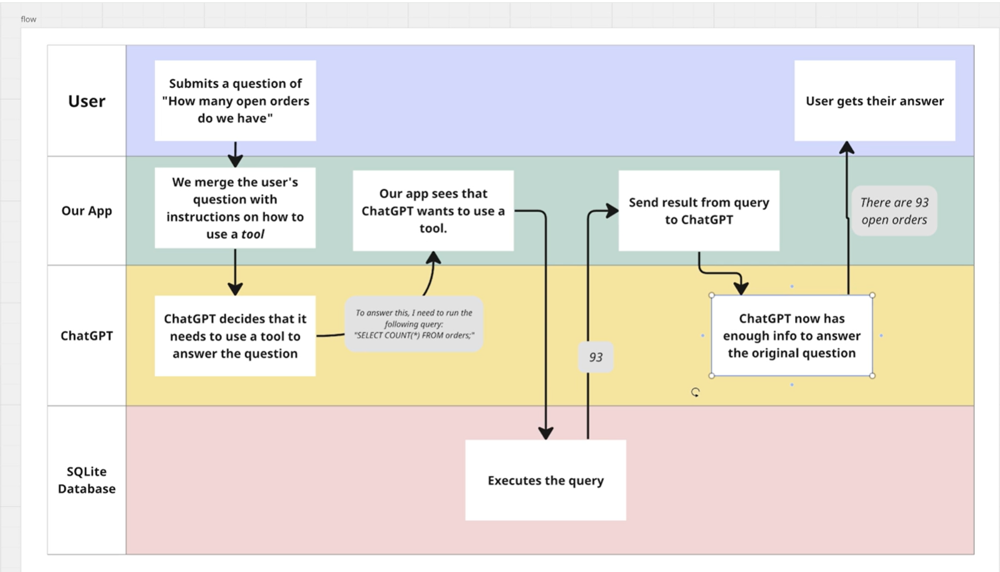

# Append the description of the second image to the existing readme.md content

# Read the existing content first
with open(readme_path, 'r') as file:
    readme_content = file.read()

# Append the new content based on the second image
readme_content += """
## Additional Flow

### Process Overview
1. The **User** submits a question: "How many open orders do we have?"
2. **Our App** interprets the question and merges it with instructions on how to use a tool.
3. **ChatGPT** recognizes the need to use a tool to answer the question and decides to run an SQL query.
4. The App recognizes ChatGPT's intention to use a tool.
5. The **SQLite Database** executes the SQL query: `SELECT COUNT(*) FROM orders;`
6. The result of the query (93) is sent back to ChatGPT.
7. ChatGPT now has enough information to answer the original question.
8. The User receives their answer: "There are 93 open orders."

### Diagrams Reference

"""

# Save the updated content back to the README.md file
with open(readme_path, 'w') as file:
    file.write(readme_content)

readme_path
